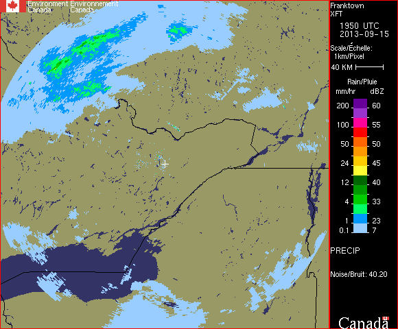

This is an unfinished project from back in 2013. The intent was to write an iOS app that would analyze Canadian weather radar maps and predict when rain would arrive at specific GPS coordinates (usually the current location of the user.)

The app code does not compile anymore, and was not functional when the project was abandonned.

Sample radar image:

